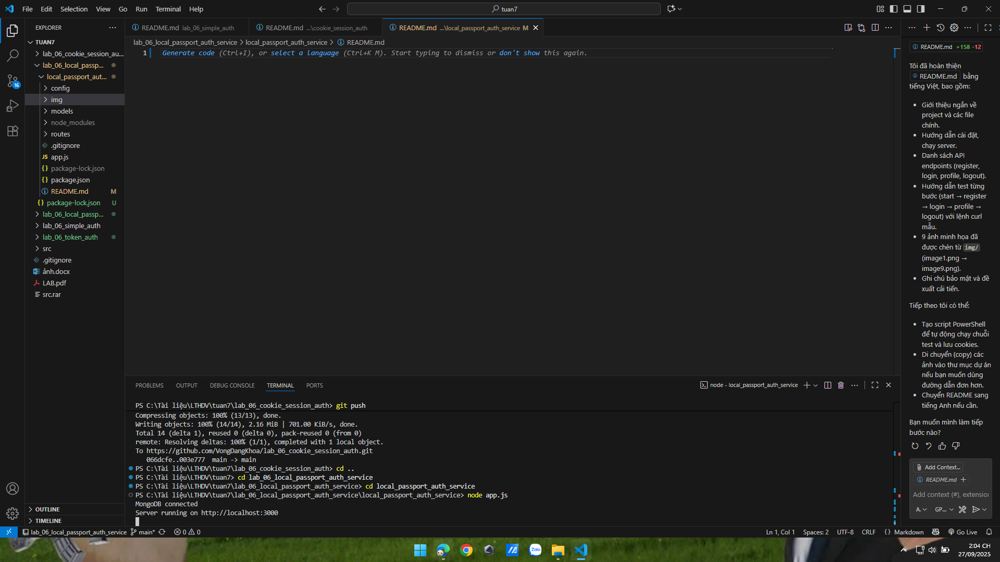
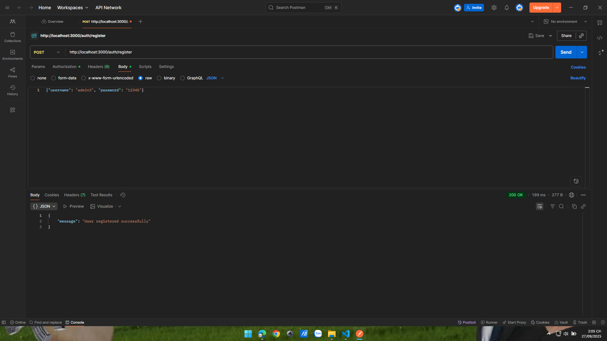
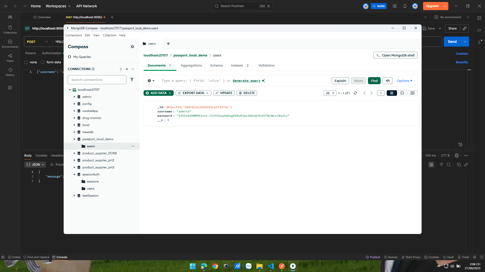
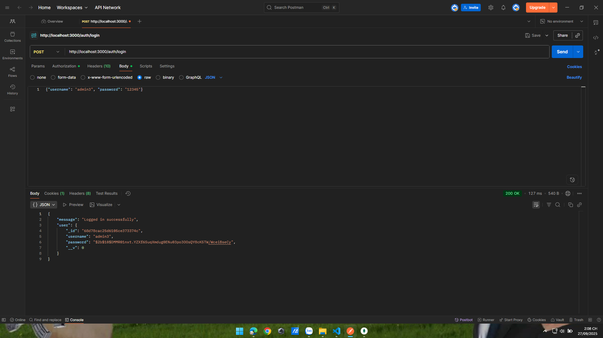

lab_06_local_passport_auth_service

Hướng dẫn kiểm thử project `local_passport_auth_service` (Passport local strategy + sessions).

File `README.md` này chứa các bước test theo đúng thứ tự bạn muốn, kèm ảnh minh họa từ thư mục `img/`.

## Mô tả ngắn

Project sử dụng Passport (passport-local) để xác thực bằng username/password và lưu trạng thái bằng session. MongoDB lưu users.

## Chuẩn bị

- Cài Node.js và npm
- Chạy MongoDB cục bộ (mặc định kết nối tới `mongodb://127.0.0.1:27017/passport_local_demo`)
- Mở PowerShell tại thư mục `local_passport_auth_service` và cài dependencies nếu cần:

```powershell
cd local_passport_auth_service
npm install
```

## Các bước test (kèm ảnh)

### Bước 1 — Khởi động server

Chạy ứng dụng:

```powershell
node app.js
```

Ảnh minh họa khi server khởi động (MongoDB connected / Server running):



### Bước 2 — Test Register (POST /auth/register)

Gửi request để đăng ký user mới.

Ví dụ (PowerShell):

```powershell
curl -X POST http://localhost:3000/auth/register -H "Content-Type: application/json" -d '{"username":"bob","password":"secret"}'
```

Ảnh minh họa gửi request register và phản hồi:





### Bước 3 — Test Login (POST /auth/login)

Gửi request login; lưu cookie để sử dụng cho các request bảo vệ.

```powershell
curl -c cookies.txt -X POST http://localhost:3000/auth/login -H "Content-Type: application/json" -d '{"username":"bob","password":"secret"}'
```

Ảnh minh họa login thành công:



### Bước 4 — (Tùy chọn) Truy cập profile / Logout

Sau khi login và có cookie, bạn có thể truy cập route bảo vệ `/auth/profile`:

```powershell
curl -b cookies.txt http://localhost:3000/auth/profile
```

Và logout:

```powershell
curl -b cookies.txt http://localhost:3000/auth/logout
```

## Ghi chú

- Các giá trị kết nối và session secret hiện được hard-coded trong `app.js`. Nên chuyển thành biến môi trường cho production.
- `bcryptjs` được sử dụng để hash password. Passport quản lý serialize/deserialize và session.

Nếu bạn muốn, tôi có thể thêm script PowerShell tự động chạy toàn bộ flow (register → login → profile → logout) và lưu cookies. Nói mình biết nếu muốn mình làm thêm.
